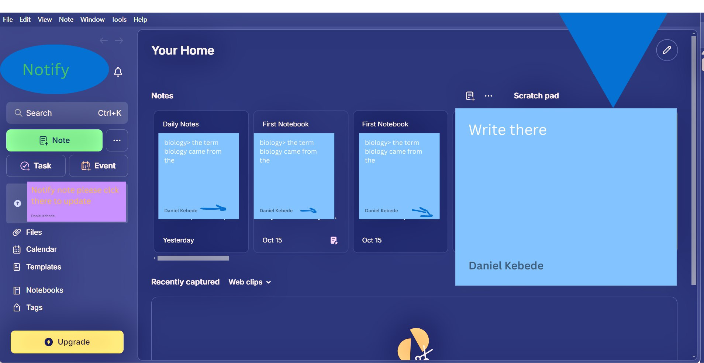

# Noteify

Noteify is a **simple, responsive, and interactive note-taking web application** .  
It helps users **create, edit, delete, and search notes** effortlessly — designed in two learning phases:  
**Phase 1 (HTML + CSS)** and **Phase 2 (JavaScript Interactivity)**.

---

## Project Synopsis

Noteify is built as a **learning and productivity web app**, combining modern frontend principles with minimalism.  
It aims to demonstrate how to progress from **static design (HTML/CSS)** to **dynamic interactivity (JavaScript)**.

Users can:

- Take notes quickly.
- Manage them locally using `localStorage`.
- Search, edit, and delete notes in real-time.

This project showcases foundational web development skills — perfect for both **learners and portfolio projects**.

---

## Implemented Solution

The solution focuses on building a lightweight, offline-friendly web app that works in the browser without any backend.  
Key implementation details include:

- **LocalStorage-based persistence** (no need for a database).
- **Responsive layout** with Flexbox and Grid.
- **Dynamic DOM manipulation** for CRUD (Create, Read, Update, Delete) operations.
- **Dark mode toggle** for better accessibility.
- **Clean UI/UX** following modern minimal design standards.

---

## Tech Stack

| Layer               | Technologies                                             |
| ------------------- | -------------------------------------------------------- |
| **Frontend**        | HTML5, CSS3 (Flexbox, Grid, Dark Mode), JavaScript (ES6) |
| **Storage**         | LocalStorage                                             |
| **Version Control** | Git & GitHub                                             |
| **Design Tools**    | Figma / Canva                                            |

---

## Project Structure

```
Noteify/
│
├── index       # Main HTML file
├── css         # App styling and dark mode
├── js         # JavaScript logic (CRUD, LocalStorage, DOM)
├── Static/           # Icons, logos, images
└── README.md         # Documentation
```

---

## Environment Setup

### Prerequisites

Make sure you have:

- A modern web browser (Chrome, Edge, Firefox, or Safari)
- A text editor (VS Code recommended)
- Git installed (optional, for cloning the repo)

### Installation & Deployment

#### **Local Setup**

1. Clone the repository:
   ```bash
   git clone https://github.com/Maxd646/noteify.git
   ```
2. Navigate into the folder:
   ```bash
   cd noteify
   ```
3. Open `index.html` in your browser.

#### **Deployment**

To deploy:

- Upload the project folder to GitHub.
- Enable GitHub Pages from repository’s settings.
- Noteify app will be live at:  
  `https://Maxd646=.github.io/noteify/`

---

## Quick Start

Once opened in your browser:

1. Click **“Add Note”** to create a new note.
2. Use the **Edit** and **Delete** buttons to manage notes.
3. Use the **Search bar** to filter notes by keywords.
4. Toggle **Dark Mode** for a comfortable viewing experience.

---

## prototype of the Noteify



---

## Features Overview

| Feature           | Description                                |
| ----------------- | ------------------------------------------ |
| Add Note          | Create new notes instantly                 |
| Edit Note         | Update note content                        |
| Delete Note       | Remove unwanted notes                      |
| Search            | Find notes by keywords                     |
| Dark Mode         | Toggle between light/dark themes           |
| Local Storage     | Auto-save notes locally (no server needed) |
| responsive Design | Works on desktop, tablet, and mobile       |

---

## Future Enhancements

- User authentication (Login/Signup)
- Cloud synchronization for notes
- Advanced tagging and categorization
- Export/Import notes (JSON format)
- Convert to a **Progressive Web App (PWA)**
- Backend System and itegrate with the Caledar(for real notification)

---

## Contributors

| Name               | Id         | Github                        |
| ------------------ | ---------- | ----------------------------- |
| **Daniel Gashaw**  | ETS0387/16 | https://github.com/Maxd646    |
| **Abrham Teramed** | ETS0094/16 | https://github.com/Abrom-code |
| **Liyuneh Rstey**  | ETS0841/15 | https://github.com/liyuneh    |
| **Amir Yimam**     | ETS0169/16 | https://github.com/miro129    |

---

## License

This project is licensed under the **MIT License**.  
You are free to use, modify, and distribute it for educational or personal purposes.

---

## Live Demo (For Future or after finished

[https://maxd646.github.io/noteify](https://maxd646.github.io/noteify)
